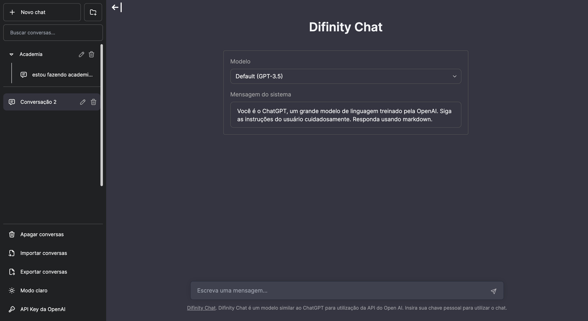

# Difinity Chat

Difinity Chat is a ChatGPT-like model for using the Open AI API, built it using Next.js, TypeScript, and Tailwind CSS.



## Modifications

Modify the chat interface in `components/Chat`.

Modify the sidebar interface in `components/Sidebar`.

Modify the system prompt in `utils/index.ts`.

## Deploy

**Vercel**

Host your own live version of Chatbot UI with Vercel.

[](https://vercel.com/new/clone?repository-url=https%3A%2F%2Fgithub.com%2Fmckaywrigley%2Fchatbot-ui)

**Docker**

```shell
docker build -t chatgpt-ui .
docker run -e OPENAI_API_KEY=xxxxxxxx -p 3000:3000 chatgpt-ui
```

## Running Locally

**1. Clone Repo**

```bash
git clone https://github.com/mckaywrigley/chatbot-ui.git
```

**2. Install Dependencies**

```bash
npm i
```

**3. Provide OpenAI API Key**

Create a .env.local file in the root of the repo with your OpenAI API Key:

```bash
OPENAI_API_KEY=YOUR_KEY
```

**4. Run App**

```bash
npm run dev
```

**5. Use It**

You should be able to start chatting.
